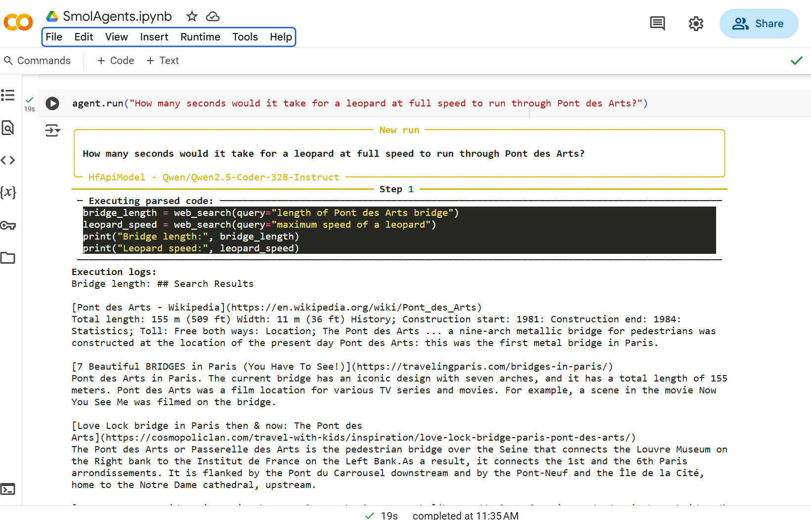

# SmolAgents: AI-Powered Automation

## Overview
SmolAgents is an AI-powered framework for automating tasks using intelligent agents. This project leverages **CodeAgent**, **DuckDuckGoSearchTool**, and **Hugging Face API** to perform automated searches, generate code, and enhance AI-driven workflows.

## Features
- 🤖 **AI-powered Code Agent** for automation
- 🔍 **DuckDuckGo Search Integration** for quick information retrieval
- 🚀 **Hugging Face API Integration** for model-based processing

## Installation
```sh
pip install smolagents
```

## Usage
```python
from smolagents import CodeAgent, DuckDuckGoSearchTool, HfApiModel

model = HfApiModel()
agent = CodeAgent(tools=[DuckDuckGoSearchTool()], model=model)

agent.run("How many seconds would it take for a leopard at full speed to run through Pont des Arts?")
```

## Applications
- AI-driven search automation
- Automated coding assistants
- Data retrieval and intelligent processing

  


## Contributing
Feel free to fork the repository, create issues, and submit pull requests!

## License
This project is licensed under the MIT License.

---
### Connect with me
Let's discuss AI automation and intelligent agents! 🚀
